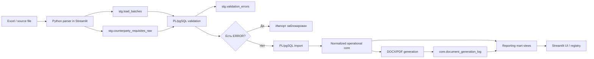

# Архитектура ContractFlow SQL — AS-IS

## Статус документа

Документ описывает фактически реализованную архитектуру текущего MVP. Он не является описанием целевой production-системы. Будущие возможности явно помечены как `Planned`.

## Позиционирование

ContractFlow SQL — инициативный ETL/Data Quality-прототип на PostgreSQL, созданный на основе реального договорного бизнес-процесса.

Проект представляет собой локальный MVP с production-like комплектом AS-IS документации и упаковкой. По типу модели это ETL/DQ-решение с нормализованным operational core и reporting marts, а не классическое dimensional DWH с фактами, измерениями и SCD.

## Общий поток данных



Основная архитектурная формулировка:

```text
Excel/source files
  → stg/raw-like layer
  → PL/pgSQL validation
  → normalized operational core
  → reporting marts
  → Streamlit UI / document generation / registry
```

## Архитектурные слои

| Слой | Роль в AS-IS | Основные объекты |
|---|---|---|
| Source | Вертикальный Excel-шаблон с реквизитами одного контрагента на лист | `demo_counterparty_requisites.xlsx` |
| Application ingestion | Чтение Excel, нормализация labels и формирование словаря полей | `06_app/app.py` |
| `stg` | Регистрация batch, хранение raw-like записи, результаты валидации и статусы обработки | `load_batches`, `counterparty_requisites_raw`, `validation_errors` |
| PL/pgSQL validation | Форматные и логические DQ-проверки, присвоение `VALID`, `VALID_WITH_WARNINGS` или `INVALID` | `stg.validate_counterparty_requisites` |
| PL/pgSQL import | Контролируемая загрузка новых валидных контрагентов в нормализованные таблицы | `stg.import_counterparty_requisites` |
| `core` | Operational core: контрагенты, реквизиты, договорные связи, документы, статусы и логи генерации | таблицы схемы `core` |
| `mart` | Reporting views для пользовательских сценариев Streamlit | `contract_status`, `document_generation_queue`, `counterparty_completeness` |
| `audit` | Заготовка под будущий аудит изменений | `audit.audit_log` |
| Presentation | UI загрузки, валидации, создания документов, генерации и реестра | Streamlit |

### Excel / source files

Excel используется как исходный бизнес-формат реквизитов. Каждый лист имеет вертикальную структуру:

- колонка A — business label;
- колонка B — значение;
- один выбранный лист преобразуется в одну логическую запись контрагента;
- физические строки Excel не загружаются как отдельные строки staging.

Файл является источником demo/MVP, а не полноценной landing zone. Исходный бинарный файл в базе не архивируется.

### Staging и raw-like данные

Отдельной схемы `raw` нет. Raw-like данные находятся в `stg.counterparty_requisites_raw`.

`stg.load_batches` хранит метаданные загрузки и агрегированные счётчики. `stg.validation_errors` хранит диагностические события с severity `ERROR` или `WARNING`.

Staging не является неизменяемым хранилищем: `processing_status` и `processed_counterparty_id` обновляются по мере обработки.

### PL/pgSQL-валидация

Валидация выполняется функцией `stg.validate_counterparty_requisites(load_batch_id)` и включает:

- обязательность ключевых полей;
- форматные regex-проверки идентификаторов и банковских реквизитов;
- правила для юридического лица и ИП;
- проверки подписантов, контактов и паспортных данных;
- поиск дублей внутри batch и уже существующих ИНН в core.

`ERROR` переводит строку в `INVALID` и блокирует импорт batch. `WARNING` допускает импорт со статусом `VALID_WITH_WARNINGS`.

Проверки ИНН, ОГРН и счетов являются форматными проверками MVP и не заменяют юридическую или контрольную проверку значений.

### Normalized operational core

Core разделяет справочники, контрагентов, банковские счета, подписантов, договорные связи, документы, события статусов и события генерации. Такая модель близка к 3NF и оптимизирована для целостности operational-процесса, а не для классической звезды DWH.

Событийные таблицы `document_status_history` и `document_generation_log` сохраняют историю, тогда как текущие состояния вычисляются в mart.

### Reporting marts

Mart-слой представлен обычными PostgreSQL views. Он преобразует нормализованные данные в удобные для UI наборы:

- текущий статус документа;
- очередь первой/повторной генерации;
- полнота реквизитов контрагента.

Отдельной физической загрузки mart нет. Данные вычисляются при выполнении запроса.

### Streamlit и генерация документов

Streamlit выступает одновременно интерфейсом оператора и точкой ручного запуска процесса. Приложение:

- читает Excel;
- записывает batch и raw-like данные;
- вызывает функции validation/import;
- создаёт договорные документы через core-функцию;
- показывает mart views;
- запускает генерацию DOCX/PDF;
- записывает результат генерации в `core.document_generation_log`.

PDF-конвертация выполняется через `docx2pdf` и требует Microsoft Word.

### Audit

`audit.audit_log` реализован только как таблица-заготовка. Триггеры и активный audit trail в AS-IS отсутствуют. Наличие схемы `audit` нельзя трактовать как работающий аудит пользовательских или системных действий.

## Границы MVP

### Implemented

- ручная загрузка Excel через UI;
- batch metadata и raw-like staging;
- PL/pgSQL DQ с `ERROR`/`WARNING`;
- импорт новых контрагентов в normalized core;
- история статусов документов;
- генерация DOCX/PDF по активному шаблону;
- лог успешной/ошибочной генерации;
- три reporting views;
- локальный demo-сценарий.

### Known limitations

- нет оркестратора, scheduler, watermark и автоматического retry;
- нет полноценной landing/raw-зоны с неизменяемыми копиями источников;
- загрузка и пользовательские действия запускаются вручную;
- нет автоматических SQL/Python-тестов и CI/CD;
- audit trail не активирован;
- mart представлены views, а не materialized/physical marts;
- проект рассчитан на локальный запуск;
- нет password-based authentication и enforced RBAC;
- PDF зависит от Microsoft Word.

### Planned / next iteration

- автоматизированные тесты и CI;
- Docker Compose и миграционный инструмент;
- инкрементальная загрузка и restart/retry strategy;
- активный audit trail;
- DQ monitoring и метрики качества;
- SCD/историзация изменяемых бизнес-атрибутов там, где это обосновано;
- индексы для подтверждённых профилем запросов;
- materialized marts или scheduled refresh при появлении требований к производительности.
