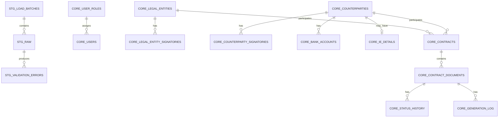

# Модель данных ContractFlow SQL — AS-IS

## Назначение

Документ описывает фактическую модель PostgreSQL в текущем MVP. Модель состоит из staging/raw-like слоя, нормализованного operational core, reporting views и заготовки для audit.

## Схемы

| Схема | Назначение | AS-IS статус |
|---|---|---|
| `stg` | Загрузка, raw-like хранение, валидация и состояние batch | Implemented |
| `core` | Нормализованные operational-сущности договорного процесса | Implemented |
| `mart` | Reporting views для Streamlit и аналитического чтения | Implemented |
| `audit` | Будущий аудит INSERT/UPDATE/DELETE | Таблица есть, активного audit trail нет |

## Модель staging

### `stg.load_batches`

Grain: одна пользовательская загрузка одного выбранного листа Excel.

Хранит имя источника, пользователя, время загрузки, статус batch, счётчики строк по результатам валидации и время импорта.

- PK: `load_batch_id`.
- FK: `uploaded_by → core.users.user_id`.
- CHECK: разрешённые `load_status`; неотрицательные счётчики.

### `stg.counterparty_requisites_raw`

Grain: одна распарсенная запись контрагента внутри batch. В текущем UI выбранный Excel-лист преобразуется в одну строку с `row_number = 1`.

Таблица хранит source labels уже в виде структурированных полей, до нормализации в отдельные core-таблицы. До трёх банковских счетов представлены повторяющимися группами колонок.

- PK: `raw_id`.
- FK: `load_batch_id → stg.load_batches`; `processed_counterparty_id → core.counterparties`.
- CHECK: тип контрагента, processing status и положительный `row_number`.

### `stg.validation_errors`

Grain: одно сработавшее DQ-правило для одной raw-строки и поля.

- PK: `validation_error_id`.
- FK: `load_batch_id → stg.load_batches`; `raw_id → stg.counterparty_requisites_raw`.
- CHECK: severity только `ERROR` или `WARNING`; положительный `row_number`.

## Модель core

### Справочники

| Таблица | Назначение | Бизнес-ключ |
|---|---|---|
| `core.user_roles` | Роли пользователей | `code` UNIQUE |
| `core.delivery_channels` | Каналы передачи/действия | `code` UNIQUE |
| `core.document_statuses` | Статусы документов | `code` UNIQUE |
| `core.document_types` | Типы договорных документов | `code` UNIQUE |
| `core.generation_statuses` | Статусы генерации файлов | `code` UNIQUE |

### Пользователи и наши юридические лица

| Таблица | Grain | Ключевые связи |
|---|---|---|
| `core.users` | один пользователь | `role_id → user_roles` |
| `core.legal_entities` | одно наше юридическое лицо | используется в contracts/templates/signatories |
| `core.legal_entity_signatories` | один подписант нашего юрлица | `legal_entity_id → legal_entities` |

Частичный UNIQUE index допускает не более одного активного подписанта на юридическое лицо.

### Контрагенты и реквизиты

| Таблица | Grain | Ключевые связи и ограничения |
|---|---|---|
| `core.counterparties` | один контрагент | `inn` UNIQUE; CHECK для типа и форматов ИНН/КПП/ОГРН |
| `core.individual_entrepreneur_details` | одна запись реквизитов ИП на контрагента | PK одновременно является FK на `counterparties` |
| `core.bank_accounts` | один банковский счёт контрагента | FK на `counterparties`; UNIQUE `(counterparty_id, account_order)`; форматные CHECK |
| `core.counterparty_signatories` | один подписант контрагента | FK на `counterparties` |

Поле `core.counterparties.ogrn` в AS-IS хранит ОГРН для юридического лица и ОГРНИП для ИП. Это фактическая особенность текущей модели, а не отдельное поле `ogrnip` в core.

### Договоры и документы

| Таблица | Grain | Ключевые связи и ограничения |
|---|---|---|
| `core.contracts` | договорная связь нашего юрлица и контрагента | FK на обе стороны; UNIQUE `(legal_entity_id, counterparty_id)` |
| `core.document_templates` | версия шаблона для юрлица и типа документа | FK на `legal_entities` и `document_types` |
| `core.contract_documents` | один договорный документ | FK на contract/type/parent/signatories; `document_number` UNIQUE |
| `core.document_status_history` | одно статусное событие документа | FK на document/status/channel/user |
| `core.document_generation_log` | одна попытка генерации файла | FK на document/template/status/user |

Для шаблонов созданы UNIQUE indexes:

- уникальность `template_path`;
- не более одного активного шаблона для пары `(legal_entity_id, document_type_id)`.

## Ключевые связи

Полная физическая ERD хранится в `07_docs/contractflow_sql_ERD.pdf`. В текущем PDF mart views не показаны, а `audit_log` визуально подписан как `core.audit_log`; фактический DDL создаёт `audit.audit_log`.

## PK, FK, UNIQUE и CHECK

- Surrogate PK преимущественно создаются как identity integer.
- FK поддерживают ссылочную целостность между operational-сущностями.
- UNIQUE используются для business identifiers и защиты от функциональных дублей.
- CHECK защищают допустимые статусы, тип контрагента и базовые форматы значений.
- Для FK явно не заданы `ON DELETE`-правила; используется стандартное ограничительное поведение PostgreSQL.
- Индексы для большинства FK и частых фильтров отдельно не созданы.

## Почему core является operational 3NF-like моделью

Core разделяет независимые сущности и повторяющиеся группы:

- банковские счета вынесены из контрагента в отдельную таблицу;
- подписанты нашего юрлица и контрагента разделены;
- справочные коды нормализованы в dictionary tables;
- статус и генерация представлены историческими событиями;
- договорная связь отделена от отдельных документов;
- шаблоны связаны с юрлицом и типом документа через FK.

Такое разделение уменьшает дублирование и поддерживает целостность транзакционного процесса. При этом модель не заявляется как строго доказанная 3NF и не является dimensional star schema.

## Reporting marts

`mart.contract_status`, `mart.document_generation_queue` и `mart.counterparty_completeness` денормализуют core для чтения и пользовательских сценариев. Это обычные views, а не physical/materialized tables.

Они предназначены для reporting/analytical consumption в рамках MVP: реестр, operational queue и контроль полноты. Подробности приведены в `marts.md`.

## Audit

`audit.audit_log` содержит структуру для имени таблицы, record ID, операции, старого/нового JSON и пользователя. В текущей реализации нет trigger/function, записывающих события в эту таблицу. Поэтому audit-модель считается `Prepared`, но не `Active`.

