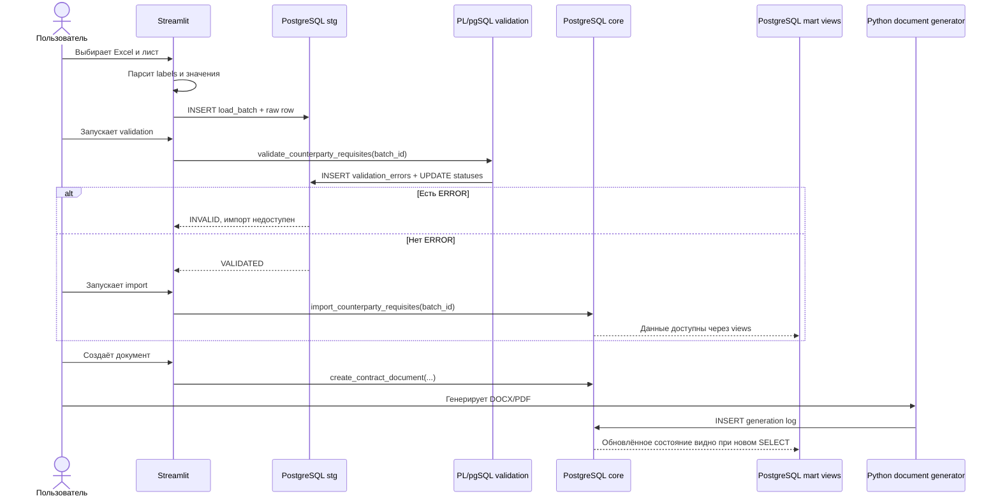

# ETL flow ContractFlow SQL — AS-IS

## Назначение

Документ описывает фактический ручной ETL/DQ-процесс MVP. В текущей реализации Streamlit выполняет роль пользовательского интерфейса и точки запуска; отдельного оркестратора нет.

## Сквозной процесс



## 1. Подготовка Excel / source file

Источник имеет вертикальную структуру: business label в колонке A, значение в колонке B. Demo-файл содержит отдельные листы для юридического лица и ИП.

Перед загрузкой пользователь выбирает один лист. Парсер нормализует labels и преобразует значения в строки/NULL. Формат source описан в `s2t_mapping.md`.

## 2. Создание batch

`insert_requisites_to_staging` создаёт строку в `stg.load_batches`:

- `source_file_name` — имя загруженного файла;
- `uploaded_by` — lookup пользователя по `core.users.username`;
- `total_rows = 1` — один выбранный лист является одной логической записью.

Если пользователь не найден, batch не создаётся.

## 3. Запись в staging

В той же application transaction создаётся одна строка `stg.counterparty_requisites_raw`:

- source metadata;
- тип и реквизиты контрагента;
- данные подписанта;
- контакты и паспорт;
- до трёх банковских счетов;
- начальный `processing_status = RAW`.

После обоих INSERT приложение выполняет commit.

## 4. Запуск validation

Пользователь вручную запускает `stg.validate_counterparty_requisites(load_batch_id)` через UI.

Функция:

1. проверяет наличие batch;
2. удаляет прежние `validation_errors` этого batch;
3. сбрасывает raw-строки batch в `RAW`;
4. повторно выполняет все DQ-правила;
5. обновляет row status и batch counters.

Validation является повторяемой для batch до импорта, но отдельной state machine, запрещающей повторную validation после `IMPORTED`, нет.

## 5. Запись validation errors

Каждое срабатывание записывается отдельной строкой в `stg.validation_errors` с:

- batch и raw ID;
- логическим row number;
- полем;
- severity;
- error code;
- сообщением;
- timestamp.

Одна raw-строка может иметь несколько ошибок и предупреждений.

## 6. Разделение ERROR и WARNING

Статус raw-строки вычисляется по приоритету:

```text
есть ERROR   → INVALID
нет ERROR,
есть WARNING → VALID_WITH_WARNINGS
иначе        → VALID
```

Batch получает `INVALID`, если существует хотя бы один `ERROR`; иначе — `VALIDATED`.

## 7. Запрет импорта при ERROR

`stg.import_counterparty_requisites` требует:

- существующий batch;
- batch ещё не импортирован;
- `load_status = VALIDATED`;
- отсутствие `ERROR`;
- отсутствие ИНН, уже существующего в core;
- наличие хотя бы одной валидной строки.

Нарушение любого условия вызывает exception. Update/upsert существующего контрагента не реализован.

## 8. Импорт в normalized core

Для каждой `VALID` или `VALID_WITH_WARNINGS` raw-строки функция создаёт:

1. `core.counterparties`;
2. `core.individual_entrepreneur_details`, только для ИП;
3. одну активную строку `core.counterparty_signatories`;
4. обязательный первый `core.bank_accounts`;
5. опциональные второй и третий счета, если заполнен account number.

После успешной обработки raw-строка получает `IMPORTED` и `processed_counterparty_id`; batch получает `IMPORTED` и `imported_at`.

Вызов функции выполняется в транзакции application session. При exception приложение не выполняет commit; частично подтверждённый импорт не является предусмотренным результатом.

## 9. Использование mart views

Отдельного load/refresh job для mart нет. Views читают актуальные core-таблицы при каждом SELECT. После commit данных core новый запрос к mart видит новое состояние по правилам PostgreSQL transaction visibility.

`mart_updated_at = now()` показывает время выполнения запроса, а не timestamp ETL refresh.

## 10. Работа через Streamlit UI

Через UI реализованы:

- выбор demo-пользователя;
- загрузка и preview Excel;
- validation/import;
- просмотр полноты контрагентов;
- создание документа;
- очередь и запуск генерации;
- обновление статуса;
- реестр и поиск.

UI не является production scheduler. Пользователь выбирается без password verification, а роли не ограничивают действия.

## 11. Создание и генерация документов

Создание operational-записи выполняет `core.create_contract_document`:

- находит или создаёт договорную связь;
- выбирает активных подписантов;
- проверяет parent document;
- формирует номер;
- создаёт `core.contract_documents`;
- добавляет начальный статус `GENERATED` с каналом `INTERNAL`.

Физический файл создаёт Python-функция `generate_document_file`:

- получает данные и активный шаблон из core;
- рендерит DOCX через `docxtpl`;
- при выборе PDF конвертирует временный DOCX через `docx2pdf`/Microsoft Word;
- сохраняет файл в `generated_documents/<юрлицо>/<тип документа>/`.

## 12. Generation log

Python generator напрямую записывает `SUCCESS` или `ERROR` в `core.document_generation_log`.

В БД также существует `core.register_document_generation`, но текущий UI-путь генерации её не вызывает. Это две параллельные реализации регистрации, которые должны быть унифицированы в следующей итерации, чтобы избежать расхождения правил имени/пути файла.

## Restart / retry limitations

### Что доступно сейчас

- validation можно повторно запустить: прежние ошибки удаляются и рассчитываются заново;
- generation queue возвращает документы без успешной генерации и документы с последним `ERROR`;
- пользователь может вручную повторить генерацию;
- повторный import batch со статусом `IMPORTED` запрещён.

### Чего нет

- production orchestrator;
- scheduler/расписание;
- watermark/high-water mark;
- автоматический retry с backoff;
- dead-letter queue;
- checkpoint/restart с шага внутри batch;
- автоматическая обработка нескольких файлов;
- CI/CD deployment pipeline;
- operational alerting и SLA monitoring.

## Статусы batch

```text
UPLOADED
  ├─ validation без ERROR → VALIDATED → import → IMPORTED
  └─ validation с ERROR   → INVALID
```

`FAILED` разрешён CHECK constraint, но отдельный стандартизированный error-handling flow, переводящий batch в `FAILED`, в текущем коде не реализован.

